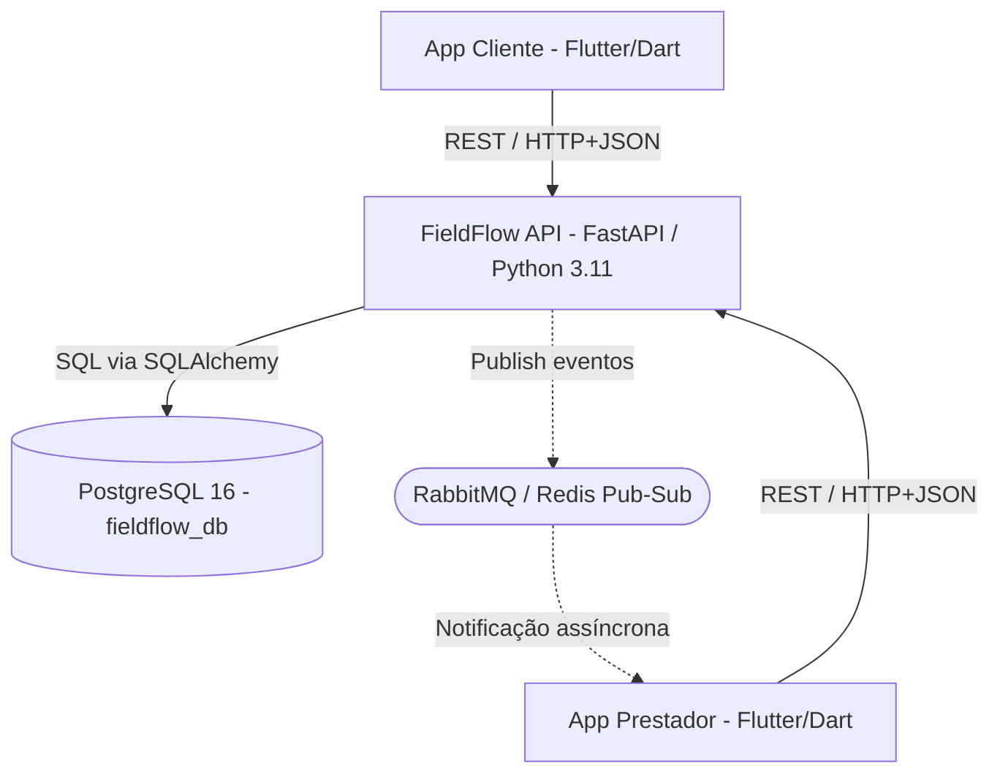
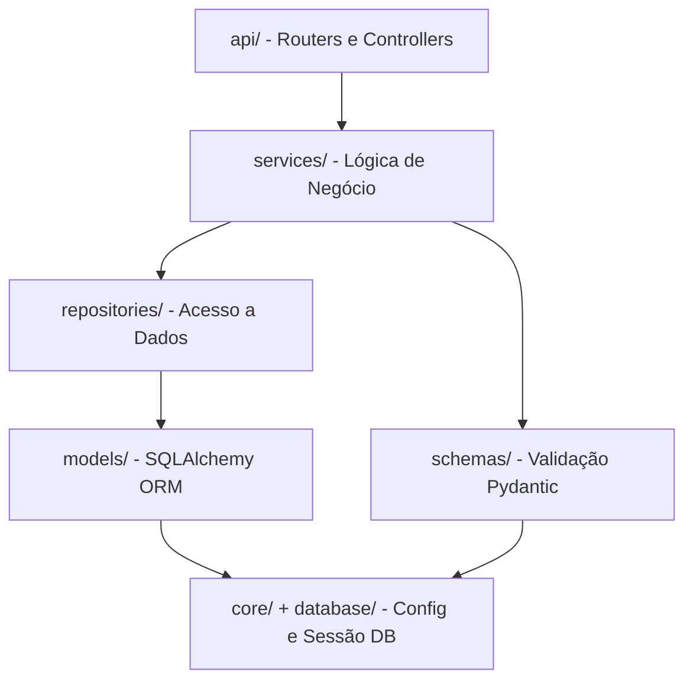

# Diagrama de Arquitetura — FieldFlow

### Visão Geral do Sistema

```mermaid
flowchart TD
    CA["App Cliente - Flutter/Dart"]
    PA["App Prestador - Flutter/Dart"]
    API["FieldFlow API - FastAPI / Python 3.11"]
    DB[("PostgreSQL 16 - fieldflow_db")]
    MOM(["RabbitMQ / Redis Pub-Sub"])

    CA -- "REST / HTTP+JSON" --> API
    PA -- "REST / HTTP+JSON" --> API
    API -- "SQL via SQLAlchemy" --> DB
    API -. "Publish eventos" .-> MOM
    MOM -. "Notificação assíncrona" .-> PA
```

### Camadas Internas do Backend

```mermaid
flowchart TD
    ROUTER["api/ - Routers e Controllers"]
    SERVICE["services/ - Lógica de Negócio"]
    REPO["repositories/ - Acesso a Dados"]
    MODEL["models/ - SQLAlchemy ORM"]
    SCHEMA["schemas/ - Validação Pydantic"]
    INFRA["core/ + database/ - Config e Sessão DB"]

    ROUTER --> SERVICE
    SERVICE --> REPO
    SERVICE --> SCHEMA
    REPO --> MODEL
    MODEL --> INFRA
    SCHEMA --> INFRA
```

