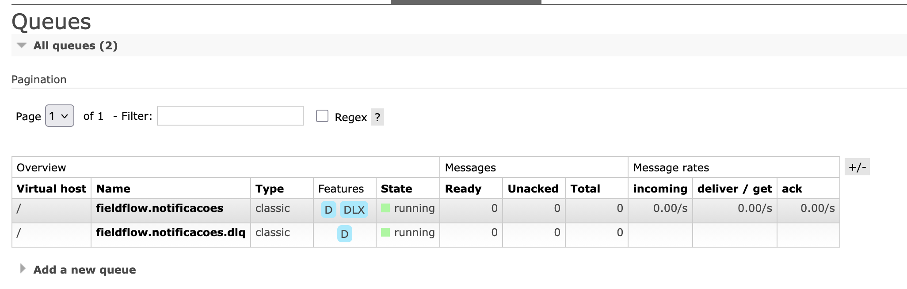
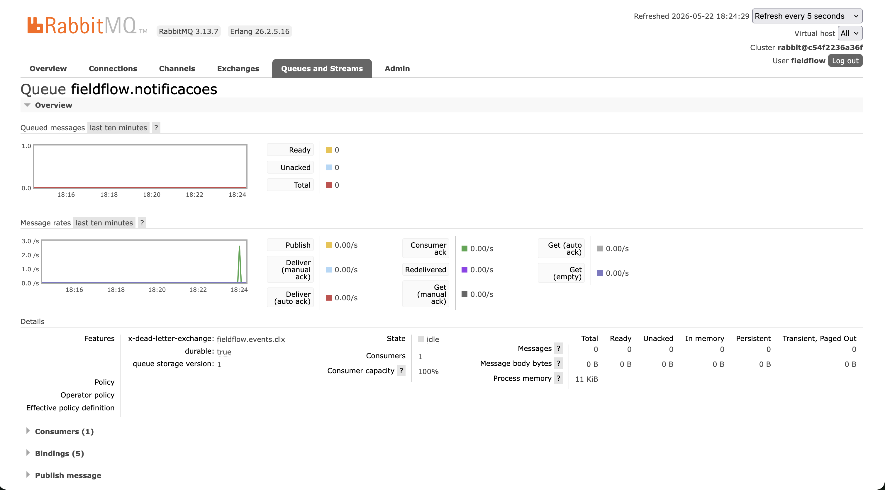
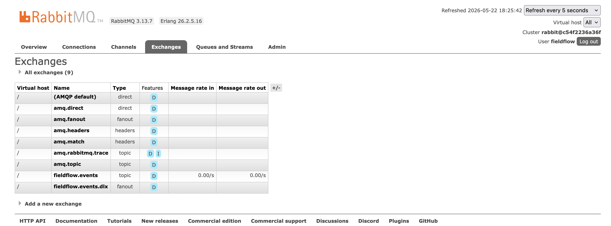
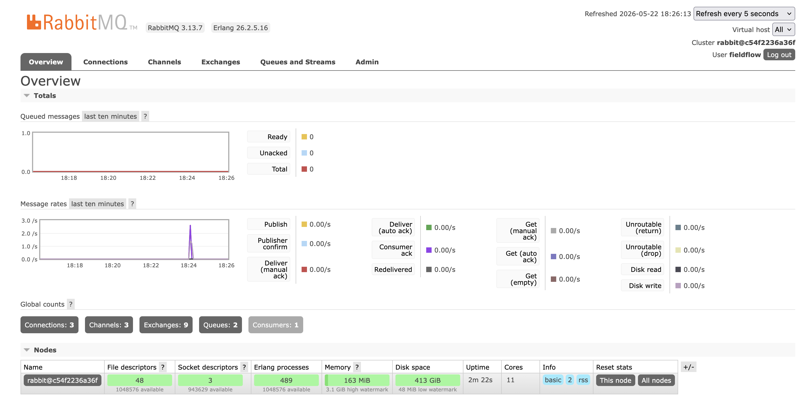

# Evidências — Sprint 2 (MOM)

Artefatos capturados após execução do roteiro descrito em `../eventos-mom.md`.

## Cenário executado
1. Cliente registra (`POST /auth/register`)
2. Dois prestadores registram (`POST /auth/register`)
3. Ambos enviam perfil (`POST /prestadores/me/perfil`) → worker aprova assincronamente
4. Cliente cria demanda (`POST /demandas`)
5. Os dois prestadores se candidatam (`POST /demandas/{id}/candidaturas`)
6. Cliente aceita o prestador 1 (`POST /candidaturas/{id}/aceitar`)
7. Worker, ao receber `candidatura.aceita`, **rejeita o prestador 2 em cascata**

Resultado: 13 eventos publicados, todos processados, 0 mensagens na DLQ.

## Prints do RabbitMQ Management (`http://localhost:15672`)

### Filas com DLQ configurada


A fila `fieldflow.notificacoes` aparece com `Features: D + DLX` (Durable + Dead-Letter Exchange), provando explicitamente a configuração de DLQ. A fila `fieldflow.notificacoes.dlq` aparece logo abaixo, também `running` e com 0 mensagens (sinal de que nenhum evento estourou erro).

### Detalhe da fila principal (com tráfego ao vivo)


Mostra `x-dead-letter-exchange: fieldflow.events.dlx` na seção Features, `Consumers: 1` + `Consumer capacity: 100%` (worker ativo), e um pico claro de ~3 msg/s no gráfico de Message rates (tráfego do cenário capturado ao vivo). O gráfico de "Queued messages" permanece zerado porque o worker consome tão rápido quanto a API publica — isso é saúde, não falta de tráfego.

### Exchanges declaradas


Entre as 7 built-in do RabbitMQ aparecem as 2 customizadas do FieldFlow: `fieldflow.events` (topic, exchange principal) e `fieldflow.events.dlx` (fanout, usado pela DLQ).

### Overview do broker


Pico no gráfico de Message rates + Global counts (`Exchanges: 9, Queues: 2, Consumers: 1`) confirmando a topologia ativa.

## Logs e dumps texto

- **`worker.log`** — logs do `fieldflow_worker` mostrando cada evento consumido (incluindo `event_id` único por mensagem e as duas reações automáticas: aprovação de perfil e rejeição em cascata)
- **`notificacoes.txt`** — saída de `GET /notificacoes`, em ordem cronológica, com routing_key + event_id + payload de cada evento (13 eventos no cenário acima)
- **`rabbitmq-exchanges.txt`** — exchanges declaradas (versão em texto da listagem)
- **`rabbitmq-queues.txt`** — filas declaradas, incluindo o argumento `x-dead-letter-exchange` na fila principal

## Como reproduzir
```bash
docker compose -f infra/docker-compose.yml down -v
docker compose -f infra/docker-compose.yml up -d
# aguardar healthchecks (~10s)
# executar cenário (registro → perfis → demanda → candidaturas → aceite)
docker compose -f infra/docker-compose.yml logs worker | grep worker
curl -sS http://localhost:8000/notificacoes | jq
```

## Cadeia de eventos observada
```
usuario.criado (×3) → prestador.perfil.enviado (×2) → prestador.aprovado (×2)
→ demanda.criada → candidatura.criada (×2) → candidatura.aceita
→ demanda.status.aceito → candidatura.rejeitada (cascata, publicada pelo worker)
```
