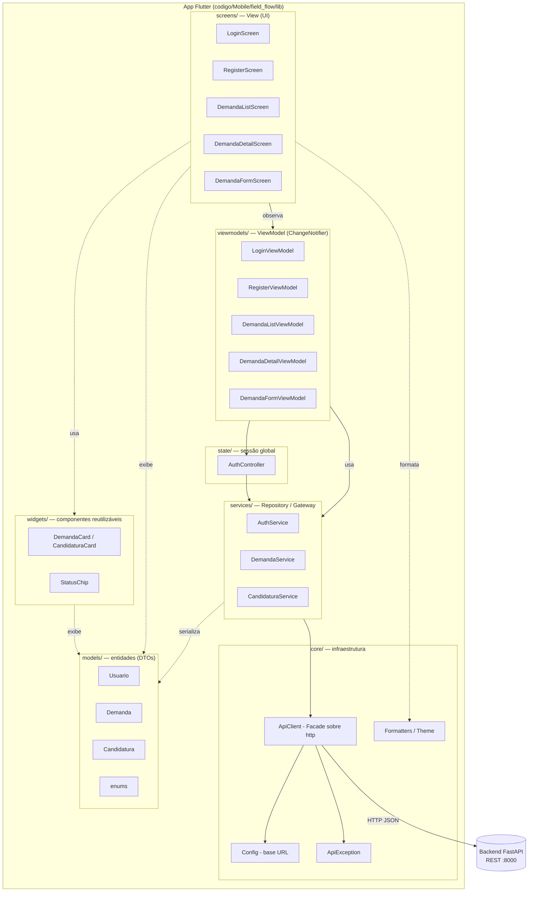

# Arquitetura do App Flutter — Cliente (Sprint 3)

App **mobile do cliente** (produtor rural) do FieldFlow. Consome a API REST das
sprints anteriores e mantém o estado sincronizado com o servidor por **polling**.

Padrão: **Clean Architecture em camadas + MVVM** (uma *View* por tela, cada uma
com seu *ViewModel* `ChangeNotifier`). A injeção/observação de estado usa o pacote
`provider`.

## Diagrama de camadas



## Responsabilidade de cada camada

| Camada | Pasta | Papel | Padrão |
|---|---|---|---|
| **View** | `screens/` | Renderiza a UI e captura input. Sem regra de negócio: observa o ViewModel via `context.watch` e delega ações. Mantém apenas `TextEditingController` (detalhe de widget). | Widget / MVVM-View |
| **Componentes** | `widgets/` | Pedaços de UI reutilizáveis (cartões, chips de status). | Composition |
| **ViewModel** | `viewmodels/` | Estado da tela (loading/erro/dados) e regras de orquestração (carregar, **polling**, aceitar, enviar). Não importa `material.dart` nem usa `BuildContext`. | MVVM / Observer (`ChangeNotifier`) |
| **Sessão** | `state/` | `AuthController`: token JWT + usuário logado, persistência da sessão e fábrica das services já autenticadas. Fonte única de "estou logado?". | Observer (`ChangeNotifier`) |
| **Service** | `services/` | Traduz endpoints REST em métodos tipados que retornam Models. | Repository / Gateway |
| **Core** | `core/` | `ApiClient` (Facade sobre `package:http`: headers, JSON, erros), `Config` (base URL configurável), `ApiException`, tema e formatters. | Facade |
| **Model** | `models/` | DTOs imutáveis com `fromJson`; espelham os schemas do backend. Atravessam todas as camadas. | DTO |

## Fluxo de uma ação (ex.: aceitar proposta)

```
DemandaDetailScreen (View)
   → DemandaDetailViewModel.aceitar(c)         // estado: aceitandoId
      → AuthController.candidaturas             // service com JWT
         → CandidaturaService.aceitar(id)
            → ApiClient.post('/candidaturas/{id}/aceitar')   // Bearer + JSON
               → Backend FastAPI
   ← recarrega demanda+candidaturas (polling/refresh)
   ← View mostra SnackBar conforme retorno (null = sucesso)
```

## Atualização assíncrona de estado (requisito da sprint)

Implementada por **polling** com `Timer.periodic` dentro dos ViewModels:

- `DemandaListViewModel`: recarrega a lista a cada **8 s**.
- `DemandaDetailViewModel`: recarrega demanda + candidaturas a cada **6 s**.

Assim, quando um prestador se candidata ou o backend muda o estado da demanda
(ex.: aceite move `PENDENTE → ACEITO` e o worker rejeita as concorrentes em
cascata), a UI do cliente reflete a mudança **sem ação manual**. Ao detectar uma
proposta nova durante o polling, o ViewModel sinaliza um evento one-shot que a
View exibe como SnackBar ("Nova proposta recebida!").

> Alternativas previstas no enunciado (WebSockets / integração com MOM) foram
> descartadas por exigirem um endpoint novo no backend; o polling atende o
> requisito com o REST já existente.

## Endpoints consumidos

| Tela / ação | Método | Endpoint |
|---|---|---|
| Login | `POST` | `/auth/login` |
| Cadastro | `POST` | `/auth/register` |
| Restaurar sessão | `GET` | `/auth/me` |
| Listagem | `GET` | `/demandas` |
| Detalhe | `GET` | `/demandas/{id}` |
| Propostas | `GET` | `/demandas/{id}/candidaturas` |
| Aceitar proposta | `POST` | `/candidaturas/{id}/aceitar` |
| Criar solicitação | `POST` | `/demandas` |

Todos (exceto login/registro) enviam `Authorization: Bearer <JWT>`.
