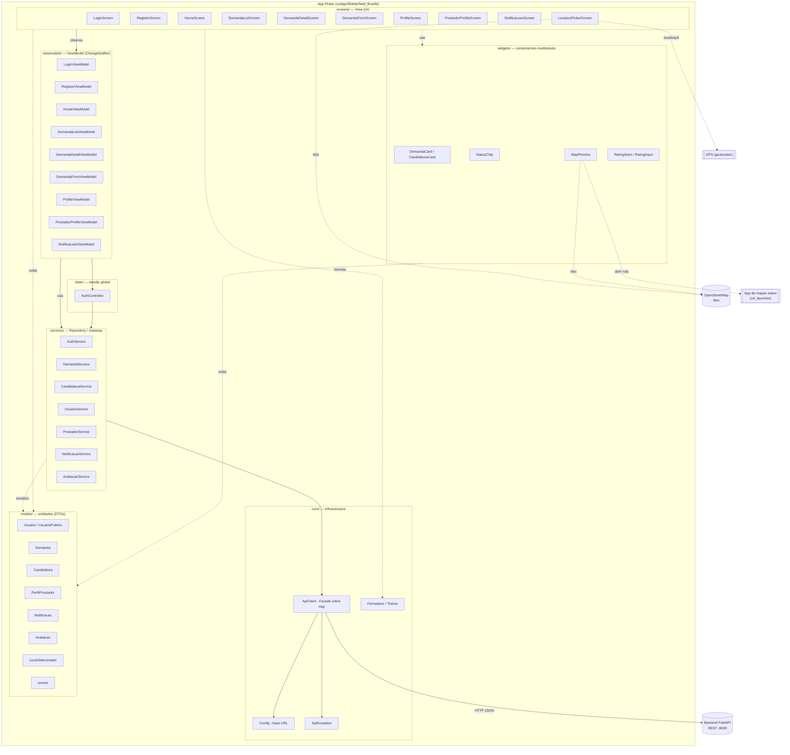

# Arquitetura do App Flutter — Cliente (Sprint 3)

App **mobile do cliente** (produtor rural) do FieldFlow. Consome a API REST das
sprints anteriores, mantém o estado sincronizado por **polling** e usa **mapa**
(OpenStreetMap) para a localização das tarefas.

Padrão: **Clean Architecture em camadas + MVVM** (uma *View* por tela, cada uma
com seu *ViewModel* `ChangeNotifier`). A injeção/observação de estado usa o pacote
`provider`.

## Funcionalidades (telas)

- **Login / Cadastro** — autenticação JWT; cadastro de cliente CPF ou CNPJ.
- **Home / Dashboard** — contadores por status, badge de notificações, atalhos.
- **Minhas solicitações** (listagem) e **Detalhe** da demanda.
- **Nova solicitação** (formulário) — com seleção do local da tarefa no mapa.
- **Meu perfil** — editar nome/e-mail/telefone, trocar senha e, para clientes
  **CNPJ**, definir o **endereço da fazenda** no mapa.
- **Perfil do prestador** — bio, experiência, especialidades, equipamentos e a
  **reputação** (nota média + comentários) antes de aceitar uma proposta.
- **Notificações** — feed de eventos do usuário (escopado por usuário no backend).
- **Avaliação** — após o serviço concluído, o cliente avalia o prestador (1–5 + comentário).

## Diagrama de camadas



## Responsabilidade de cada camada

| Camada | Pasta | Papel | Padrão |
|---|---|---|---|
| **View** | `screens/` | Renderiza a UI e captura input. Sem regra de negócio: observa o ViewModel via `context.watch` e delega ações. Mantém apenas `TextEditingController` (detalhe de widget). | Widget / MVVM-View |
| **Componentes** | `widgets/` | Pedaços de UI reutilizáveis (cartões, chips, mini-mapa, estrelas de avaliação). | Composition |
| **ViewModel** | `viewmodels/` | Estado da tela (loading/erro/dados) e regras de orquestração (carregar, **polling**, aceitar, concluir, avaliar, enviar). Não importa `material.dart` nem usa `BuildContext`. | MVVM / Observer (`ChangeNotifier`) |
| **Sessão** | `state/` | `AuthController`: token JWT + usuário logado, persistência da sessão e fábrica das services já autenticadas. Fonte única de "estou logado?". | Observer (`ChangeNotifier`) |
| **Service** | `services/` | Traduz endpoints REST em métodos tipados que retornam Models. | Repository / Gateway |
| **Core** | `core/` | `ApiClient` (Facade sobre `package:http`: headers, JSON, erros), `Config` (base URL configurável), `ApiException`, tema e formatters. | Facade |
| **Model** | `models/` | DTOs imutáveis com `fromJson`; espelham os schemas do backend. Atravessam todas as camadas. | DTO |

## Fluxo de uma ação (ex.: avaliar prestador)

```
DemandaDetailScreen (View)
   → _AvaliacaoDialog (estrelas + comentário)
      → DemandaDetailViewModel.avaliar(nota, comentario)   // estado: avaliando
         → AuthController.avaliacoes                        // service com JWT
            → AvaliacaoService.criar(demandaId, nota, comentario)
               → ApiClient.post('/demandas/{id}/avaliacao') // Bearer + JSON
                  → Backend FastAPI (valida: dono + CONCLUIDO + 1x)
   ← View mostra SnackBar e passa a exibir "Sua avaliação"
```

## Atualização assíncrona de estado (requisito da sprint)

Implementada por **polling** com `Timer.periodic` dentro dos ViewModels:

- `HomeViewModel`: recarrega contadores + notificações a cada **8 s**.
- `DemandaListViewModel`: recarrega a lista a cada **8 s**.
- `DemandaDetailViewModel`: recarrega demanda + candidaturas a cada **6 s**.
- `NotificacoesViewModel`: recarrega o feed a cada **10 s**.

Assim, quando um prestador se candidata ou o backend muda o estado da demanda
(ex.: aceite move `PENDENTE → ACEITO` e o worker rejeita as concorrentes em
cascata), a UI do cliente reflete a mudança **sem ação manual**. Ao detectar uma
proposta nova durante o polling, o ViewModel sinaliza um evento one-shot que a
View exibe como SnackBar ("Nova proposta recebida!").

> Alternativas previstas no enunciado (WebSockets / integração com MOM) foram
> descartadas por exigirem um endpoint novo no backend; o polling atende o
> requisito com o REST já existente.

## Geolocalização / Mapa

- **Stack:** `flutter_map` + **OpenStreetMap** (sem API key / sem billing),
  `latlong2`, `geolocator` (GPS) e `url_launcher` (abrir o app de mapas nativo).
- **Local da tarefa (toda demanda):** o `LocationPickerScreen` usa um pino fixo
  no centro do mapa; o usuário arrasta o mapa para posicioná-lo, com botão "usar
  minha localização" (GPS) e um *fallback* de centro (região agrícola) quando não
  há GPS. Salva `origem_lat/lng` (e `destino_lat/lng`) + um rótulo de texto.
- **Detalhe:** `MapPreview` mostra o pino e um botão **"Abrir no Maps"** que
  dispara a navegação no app nativo.
- **Endereço da fazenda (cliente CNPJ):** salvo no perfil (`endereco` +
  `endereco_lat/lng`); usado para **pré-centrar** o mapa ao criar uma demanda.

## Reputação / Avaliações

Após a demanda chegar a `CONCLUIDO`, o cliente avalia o prestador (nota 1–5 +
comentário), **uma vez por demanda**. A nota média e o total agregados aparecem
no **perfil do prestador**, ajudando a decisão antes de aceitar uma proposta.

## Mudanças no backend nesta sprint

Para suportar o app, o backend (FastAPI, Clean Architecture) ganhou:

- **Módulo `avaliacoes/`** (domain/application/infrastructure/presentation):
  tabela `avaliacoes`, regras (só o cliente dono, só após `CONCLUIDO`, 1 por
  demanda) e agregação de nota média/total no perfil do prestador.
- **Colunas de geolocalização:** `demandas.origem_lat/lng`, `destino_lat/lng` e
  `usuarios.endereco/endereco_lat/lng` (migration `0003_maps_localizacao`).
- **Notificações escopadas por usuário:** `GET /notificacoes` passou a exigir
  autenticação e a retornar apenas os eventos relevantes ao usuário (antes era um
  log global sem auth).
- Migrations Alembic idempotentes (`0003`, `0004`).

## Endpoints consumidos

| Tela / ação | Método | Endpoint |
|---|---|---|
| Login / Cadastro / Restaurar sessão | `POST` / `POST` / `GET` | `/auth/login`, `/auth/register`, `/auth/me` |
| Trocar senha | `PUT` | `/auth/me/senha` |
| Editar perfil / endereço da fazenda | `PUT` | `/usuarios/{id}` |
| Dados públicos de um usuário | `GET` | `/usuarios/{id}` |
| Listagem / Detalhe / Criar | `GET` / `GET` / `POST` | `/demandas`, `/demandas/{id}`, `/demandas` |
| Transição de status (concluir) | `PATCH` | `/demandas/{id}/status` |
| Propostas / Aceitar | `GET` / `POST` | `/demandas/{id}/candidaturas`, `/candidaturas/{id}/aceitar` |
| Perfil do prestador (com reputação) | `GET` | `/prestadores/{id}/perfil` |
| Notificações (escopadas) | `GET` | `/notificacoes` |
| Avaliar / ver avaliação / avaliações do prestador | `POST` / `GET` / `GET` | `/demandas/{id}/avaliacao`, `/demandas/{id}/avaliacao`, `/prestadores/{id}/avaliacoes` |

Todos (exceto login/registro) enviam `Authorization: Bearer <JWT>`.
