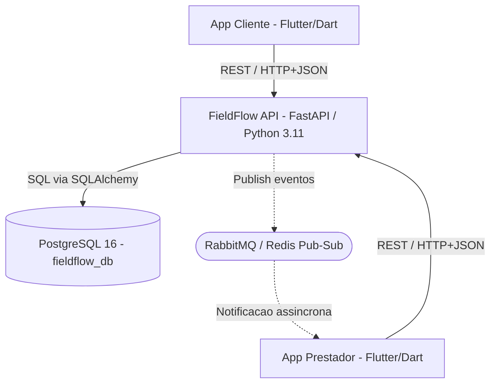
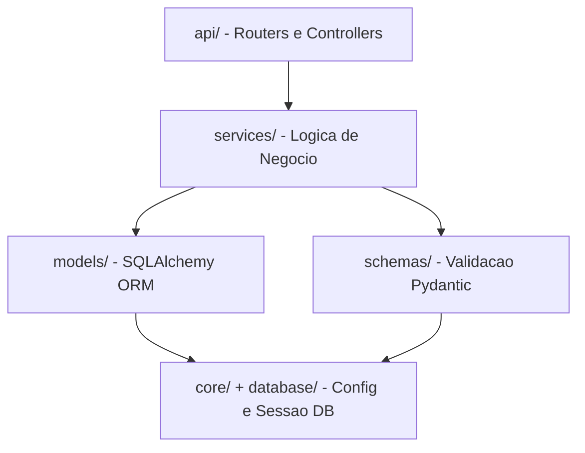

# Diagrama de Arquitetura — FieldFlow

### Visão Geral do Sistema



### Camadas Internas do Backend



## Componentes

| Componente | Tecnologia | Responsabilidade |
|---|---|---|
| App Cliente | Flutter / Dart | Criar e acompanhar demandas de serviço |
| App Prestador | Flutter / Dart | Receber, aceitar e executar demandas |
| Backend API | FastAPI (Python 3.11) | Expor endpoints REST, orquestrar a lógica de negócio |
| Banco de Dados | PostgreSQL 16 | Persistência das demandas e seus estados |
| MOM | RabbitMQ ou Redis Pub/Sub | Comunicação assíncrona orientada a eventos (Sprint 2) |
| Infraestrutura | Docker Compose | Orquestração dos serviços (API + DB + MOM) |

## Protocolos de Comunicação

| Origem | Destino | Protocolo | Formato |
|---|---|---|---|
| App Cliente | Backend API | HTTP/REST | JSON |
| App Prestador | Backend API | HTTP/REST | JSON |
| Backend API | PostgreSQL | TCP / protocolo PostgreSQL | SQL via SQLAlchemy ORM |
| Backend API | MOM | AMQP (RabbitMQ) ou Redis protocol | JSON (payload de evento) |
| MOM | App Prestador | WebSocket / polling assíncrono | JSON |

## Schema do Banco de Dados — Sprint 1

### Tabela `demandas`

| Coluna | Tipo | Restrição | Descrição |
|---|---|---|---|
| id | INTEGER | PK, autoincrement | Identificador único |
| cliente_id | INTEGER | NOT NULL | ID do produtor que criou a demanda |
| prestador_id | INTEGER | nullable | ID do prestador que aceitou (preenchido no aceite) |
| titulo | VARCHAR | NOT NULL | Título da demanda |
| descricao | VARCHAR | NOT NULL | Descrição detalhada do serviço |
| origem | VARCHAR | NOT NULL | Localização da propriedade |
| destino | VARCHAR | nullable | Destino (quando aplicável) |
| area_hectares | FLOAT | NOT NULL | Área a ser trabalhada (ha) |
| valor_recompensa | FLOAT | NOT NULL | Valor do contrato (R$) |
| tipo_servico | VARCHAR | NOT NULL | Tipo de serviço agrícola |
| data_limite | DATE | nullable | Prazo limite para execução |
| status | ENUM | NOT NULL, default PENDENTE | PENDENTE → ACEITO → EM_EXECUCAO → CONCLUIDO |

## Endpoints REST — Sprint 1

| Método | Rota | Descrição |
|---|---|---|
| GET | /health | Health check da API |
| POST | /demandas | Criar nova demanda |
| GET | /demandas | Listar todas as demandas |
| GET | /demandas/{id} | Buscar demanda por ID |
| PATCH | /demandas/{id}/status | Atualizar status (e atribuir prestador) |
| PUT | /demandas/{id} | Atualizar dados da demanda |
| DELETE | /demandas/{id} | Remover demanda |

## Fluxo de Eventos (Arquitetura Orientada a Eventos)

```
Cliente cria demanda
        │
        ▼
[POST /demandas] → API persiste no PostgreSQL
        │
        ▼ (Sprint 2)
API publica evento "demanda.criada" no MOM
        │
        ▼ (Sprint 2)
App Prestador recebe notificação assíncrona
        │
        ▼
[PATCH /demandas/{id}/status] → status=ACEITO, prestador_id=X
        │
        ▼ (Sprint 2)
API publica evento "demanda.aceita" no MOM
        │
        ▼ (Sprint 2)
App Cliente recebe atualização assíncrona
```